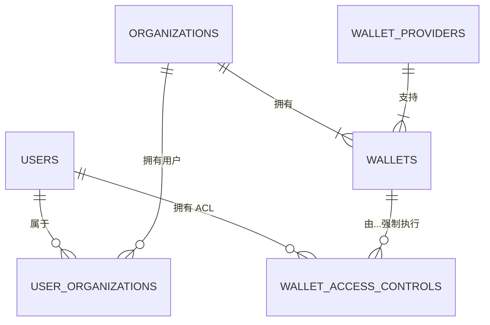

# 钱包服务实施规范 – **技术 TODO (MVP)**

_OpenStableNetwork • API v4 • 最后更新: 2025年4月23日_

---

## 0 快速索引

1. [术语表](#1-术语表)
2. [托管模型 & 流程图](#2-托管模型--流程图)
3. [数据库模式 & 枚举](#3-数据库模式--枚举)
4. [状态机](#4-状态机)
5. [API 合约](#5-api-合约)
6. [服务职责 & 代码骨架](#6-服务职责--代码骨架)
7. [系统上下文 & 相关服务](#7-系统上下文--相关服务)
8. [可观察性 & 开发运维交付物](#8-可观察性--开发运维交付物)
9. [Sprint 清单](#9-sprint-清单)
10. [完成定义](#10-完成定义)
11. [当前实施状态 & 差距分析](#11-当前实施状态--差距分析)
12. [附录 A – 实时数据库模式 (2025年4月23日)](#附录-a-–-实时数据库模式快照-2025年4月23日)
13. [附录 B – Postgres 迁移计划](#附录-b-–-postgres-迁移计划)

---

## 1 术语表


| 术语                                 | 含义                                                                                                                         |
| ------------------------------------ | ---------------------------------------------------------------------------------------------------------------------------- |
| **托管类型**<br>`provider_type`      | 私钥存放位置:`metamask`, `fireblocks`, `hex_trust`, `self_custody` (阶段 2 - MVP 中不包含)                                   |
| **钱包提供商**                       | 托管集成的配置记录                                                                                                           |
| **PSP**                              | 支付服务提供商                                                                                                               |
| **KMS / HSM**                        | 自我托管的密钥管理或硬件安全模块 (阶段 2 - MVP 中不包含)                                                                     |
| **ACL / `access_level`**             | `owner`, `admin`, `operator`, `viewer` (所有者, 管理员, 操作员, 查看者)                                                      |
| **交易状态**<br>`Tx status`          | `pending_signature`, `signed`, `rejected`, `submitted`, `failed`, `confirmed` (待签名, 已签名, 已拒绝, 已提交, 失败, 已确认) |
| **幂等性密钥**<br>`Idempotency‑Key` | 用于确保变更请求最多执行一次的标头                                                                                           |

---

## 2 托管模型 & 流程图

### 2.1 拓扑结构

```
┌────────────────┐      ┌────────────────┐      ┌───────────────────┐
│  转账服务      │◄───►│   钱包服务      │◄───►│  托管后端         │
└────────────────┘      └────────────────┘      └───────────────────┘
                                     ▲
                                     └─ MetaMask (仅浏览器签名)
```

### 2.2 流程

#### MetaMask / 浏览器钱包

```
转账服务 → 钱包服务 → 前端 (MetaMask) → 钱包服务 → 转账服务 → 区块链
```

#### 托管 MPC (Fireblocks/Hex Trust) - MVP 重点

签名

```
转账服务 → 钱包服务 → 托管 API → 钱包服务 → 转账服务 → 区块链
```

**MVP 实施策略:**

- 我们将 **首先交付 Fireblocks 集成** (主要重点)，因其 API 成熟且具有完善的保险库账户结构
- **Hex Trust** 将作为插件以类似架构实现，因其 API 遵循类似的 MPC 风格模型
- 两者都允许进行机构级的钱包管理，具有适当的密钥安全性和治理

#### 自我托管 (KMS/HSM) - 阶段 2, 不在 MVP 范围内

```
转账服务 → 钱包服务 → KMS/HSM → 钱包服务 → 转账服务 → 区块链
```

*注意: 自我托管模型不包含在 MVP 范围内，但 API/DB 接口保持不变以备将来兼容。*

---

## 3 数据库模式 & 枚举

> **迁移:** 使用您选择的框架；脚本必须是幂等的且可逆的。

```sql
-- 钱包提供商
CREATE TABLE wallet_providers (
  id TEXT PRIMARY KEY,
  name TEXT NOT NULL,
  provider_type TEXT NOT NULL CHECK (provider_type IN ('fireblocks','hex_trust','self_custody')), -- 托管类型
  credentials JSONB NOT NULL, -- 凭证
  status TEXT NOT NULL DEFAULT 'active' CHECK (status IN ('active','inactive')), -- 状态：活跃，不活跃
  created_at TIMESTAMP WITH TIME ZONE DEFAULT now(), -- 创建时间
  updated_at TIMESTAMP WITH TIME ZONE DEFAULT now()  -- 更新时间
);

-- 钱包
CREATE TABLE wallets (
  id TEXT PRIMARY KEY,
  organization_id TEXT REFERENCES organizations(id), -- 组织 ID
  provider_type TEXT NOT NULL CHECK (provider_type IN ('metamask','fireblocks','hex_trust','self_custody')), -- 提供商类型，self_custody = 保留 (阶段 2)
  wallet_provider TEXT REFERENCES wallet_providers(id), -- 钱包提供商 ID
  blockchain TEXT NOT NULL, -- 区块链
  network TEXT NOT NULL, -- 网络
  address TEXT NOT NULL, -- 地址
  status TEXT NOT NULL DEFAULT 'pending_configuration' -- 状态：活跃，待配置，不活跃，已暂停
         CHECK (status IN ('active','pending_configuration','inactive','suspended')),
  default_wallet BOOLEAN NOT NULL DEFAULT FALSE, -- 是否默认钱包
  description TEXT, -- 描述
  created_at TIMESTAMP WITH TIME ZONE DEFAULT now(), -- 创建时间
  updated_at TIMESTAMP WITH TIME ZONE DEFAULT now(), -- 更新时间
  UNIQUE(blockchain, network, address) -- 唯一约束：区块链、网络、地址
);

-- 访问控制
CREATE TABLE wallet_access_controls (
  wallet_id TEXT REFERENCES wallets(id) ON DELETE CASCADE, -- 钱包 ID
  user_id TEXT REFERENCES users(id) ON DELETE CASCADE, -- 用户 ID
  access_level TEXT NOT NULL CHECK (access_level IN ('owner','admin','operator','viewer')), -- 访问级别：所有者，管理员，操作员，查看者
  daily_limit NUMERIC, -- 每日限额
  approval_required BOOLEAN DEFAULT FALSE, -- 是否需要审批
  created_at TIMESTAMP WITH TIME ZONE DEFAULT now(), -- 创建时间
  updated_at TIMESTAMP WITH TIME ZONE DEFAULT now(), -- 更新时间
  PRIMARY KEY(wallet_id, user_id) -- 主键：钱包 ID，用户 ID
);

-- 交易签名
CREATE TABLE transaction_signatures (
  id TEXT PRIMARY KEY,
  wallet_id TEXT REFERENCES wallets(id) ON DELETE CASCADE, -- 钱包 ID
  unsigned_tx JSONB NOT NULL, -- 未签名交易
  signed_tx JSONB, -- 已签名交易
  status TEXT NOT NULL CHECK (status IN ('pending_signature','signed','rejected','submitted','failed','confirmed')), -- 状态：待签名，已签名，已拒绝，已提交，失败，已确认
  expires_at TIMESTAMP WITH TIME ZONE, -- 过期时间
  created_at TIMESTAMP WITH TIME ZONE DEFAULT now(), -- 创建时间
  updated_at TIMESTAMP WITH TIME ZONE DEFAULT now()  -- 更新时间
);
```

### 3.1 枚举


| 枚举            | 值                                                                          |
| --------------- | --------------------------------------------------------------------------- |
| `provider_type` | `metamask`, `fireblocks`, `hex_trust`, `self_custody` (阶段 2)              |
| `wallet_status` | `active`, `pending_configuration`, `inactive`, `suspended`                  |
| `access_level`  | `owner`, `admin`, `operator`, `viewer`                                      |
| `tx_status`     | `pending_signature`, `signed`, `rejected`, `submitted`,`failed`,`confirmed` |

> 无效枚举 → HTTP 422。

### 3.2 钱包记录生命周期 & 历史

所有由用户创建或连接的钱包（包括旧的 MetaMask 地址、遗留的托管保险库等）**在平台的整个生命周期内都保留在 `wallets` 表中**。在 UI 中删除钱包只是翻转其 `status`：


| 状态                    | 含义                                    | 典型触发器                                        |
| ----------------------- | --------------------------------------- | ------------------------------------------------- |
| `pending_configuration` | 新创建的记录，等待托管方设置 / 用户批准 | Fireblocks 保险库正在配置，Hex Trust 账户等待批准 |
| `active`                | 钱包完全可用于余额查询和签名            | 托管方设置完成 / MetaMask 地址已验证              |
| `inactive`              | 钱包已被用户或组织管理员明确取消链接    | 用户断开 MetaMask 连接，组织停用保险库            |
| `suspended`             | 被合规 / 风险工具暂时禁用               | 风险引擎标记异常活动                              |

我们 **从不硬删除** 行；保留记录允许：

- 历史余额和转账查询
- 审计谁连接/断开了哪个钱包
- 如果用户重新连接相同的地址，可以重新激活

#### 可选：连接历史审计表

如果需要更精细的审计，添加：

```sql
CREATE TABLE wallet_connection_history (
  id TEXT PRIMARY KEY,
  wallet_id TEXT REFERENCES wallets(id) ON DELETE CASCADE, -- 钱包 ID
  user_id TEXT REFERENCES users(id),           -- 执行操作的用户
  action TEXT NOT NULL CHECK (action IN ('connected','disconnected','reconnected')), -- 操作：已连接，已断开，已重新连接
  context JSONB,                              -- 例如：浏览器信息，托管方响应
  created_at TIMESTAMP WITH TIME ZONE DEFAULT now() -- 创建时间
);
```

此表可以由 API 层在每次连接或断开钱包时填充，提供完整的时间线，而不会用瞬态元数据污染主 `wallets` 表。

### 3.3 关系图 – 用户、组织、钱包 & 托管方

支撑访问控制和签名流程的逻辑链接：



关键点：

1. **用户 ↔ 组织** – 一个用户属于*至少*一个组织 (MVP 可以将其存储为 `users.organization_id`；通过连接表 `user_organizations` 来面向未来)。
2. **组织 ↔ 钱包** – 每个钱包行都带有 `organization_id`; 多个用户可以通过 ACL 访问同一个钱包。
3. **ACL 强制执行 (`wallet_access_controls`)** – 复合主键 `(wallet_id, user_id)` 和 `access_level` 枚举确保精确的权限检查 (所有者/管理员/操作员/查看者)。
4. **钱包 ↔ 托管方 (`wallet_providers`)** – `wallet_provider` 外键选择托管方适配器；`provider_type` 驱动运行时分派 (`_sign_fireblocks`, `_sign_hex_trust`, …)。

此映射必须由 §11.3 和附录 B 中描述的迁移来遵守，以解锁组织共享钱包和正确的托管路由。

---

## 4 状态机

### 钱包状态


| 从 \ 到                            | active (活跃) | pending_configuration (待配置) | inactive (不活跃) | suspended (暂停) |
| ---------------------------------- | ------------- | ------------------------------ | ----------------- | ---------------- |
| **active (活跃)**                  | —            | ✓                             | ✓                | ✓               |
| **pending_configuration (待配置)** | ✓            | —                             | ✓                | ✓               |
| **inactive (不活跃)**              | ✓            | —                             | —                | ✓               |
| **suspended (暂停)**               | ✗            | ✗                             | ✗                | —               |

✗ = 禁止 → HTTP 409。

### 交易生命周期

```
Pending (待处理) → Signed (已签名) → Submitted (已提交) → Confirmed (已确认)
    └─────┬─────┘             ↘ Failed (失败)
          ↘ Rejected (已拒绝)
```

*默认 `expires_at` = 10 分钟。*

---

## 5 API 合约

基础路径: `/api/v4` | 所有端点都需要身份验证。

### 5.1 钱包 CRUD

- **POST** `/wallets` - 创建钱包
- **GET** `/wallets` (过滤器: `status`, `blockchain`, `organization_id`) - 获取钱包列表
- **GET** `/wallets/{id}` - 获取单个钱包
- **PATCH** `/wallets/{id}` (字段: `name`, `description`, `default_wallet`) - 更新钱包

### 5.2 余额

- **GET** `/wallets/{id}/balances` → `[{currency, amount}]` - 获取钱包余额

### 5.3 签名

- **POST** `/wallets/{id}/sign` → `{status, signature_request_id, unsigned_tx?}` - 发起签名请求
- **POST** `/wallets/submit_signature` → `{status: "signed", signature_request_id}` - 提交签名

### 5.4 示例

#### 创建钱包

```json
POST /api/v4/wallets
{o
  "name": "我的 MetaMask 钱包",
  "blockchain": "ethereum",
  "network": "mainnet",
  "provider_type": "metamask",
  "address": "0x123..."
}
```

#### 发起签名

```json
POST /api/v4/wallets/{id}/sign
{
  "to": "0x456...",
  "amount": "0.1",
  "currency": "ETH"
}
→
{
  "status": "requires_frontend_signature", // 需要前端签名
  "signature_request_id": "req_abc",
  "unsigned_transaction": { /* EIP‑1559 字段 */ }
}
```

### 5.5 错误模型

```jsonc
{
  "error_code": "wallet_not_found", // 钱包未找到
  "message": "Wallet not accessible", // 钱包无法访问
  "details": { "parameter": "wallet_id", "value": "..." }
}
```

常见代码:

- `400 invalid_payload` - 无效负载
- `401 unauthenticated` - 未经身份验证
- `403 unauthorized` - 未授权
- `404 not_found` - 未找到
- `409 conflict` - 冲突
- `422 validation_error` - 验证错误
- `429 rate_limited` - 请求频率过高
- `500 internal_error` - 内部错误

### 5.6 幂等性

所有变更端点都接受 **Idempotency‑Key** 标头；第一次成功响应将在 24 小时内重用于重试。

---

## 6 服务职责 & 代码骨架

### WalletService (钱包服务)

```python
class WalletService:
    async def create_wallet(self, user_id, data, organization_id=None): ... # 创建钱包
    async def get_wallet(self, wallet_id, user_id=None): ... # 获取钱包
    async def list_wallets(self, user_id, filters=None): ... # 列出钱包
    async def update_wallet(self, wallet_id, patch, acting_user): ... # 更新钱包
    async def get_wallet_balances(self, wallet_id, acting_user=None): ... # 获取钱包余额
    async def update_wallet_balance(self, wallet_id, currency, delta): ... # 更新钱包余额
    async def add_user_access(self, wallet_id, user_id, level): ... # 添加用户访问权限
    async def remove_user_access(self, wallet_id, user_id): ... # 移除用户访问权限
```

*强制执行 ACL；在单个序列化事务中更新分类账。*

### WalletSigningService (钱包签名服务)

```python
class WalletSigningService:
    async def sign_transaction(self, wallet_id, tx_data, user_id):
        wallet = await WalletService().get_wallet(wallet_id, user_id)
        handler = getattr(self, f"_sign_{wallet['provider_type']}")
        return await handler(wallet, tx_data)

    async def _sign_metamask(self, wallet, tx):
        """
        1. 生成未签名的交易对象
        2. 返回状态 'requires_frontend_signature' (需要前端签名)
        3. 前端处理浏览器 MetaMask 交互
        4. 等待带有签名交易的回调
        """
        # 实现

    async def _sign_fireblocks(self, wallet, tx):
        """
        1. 构建 Fireblocks 'createTransaction' 负载 (VAULT → EXTERNAL)
        2. POST /v1/transactions
        3. 轮询 /v1/transactions/{id} 直到状态为 'COMPLETED' 或 'FAILED'
        4. 将 Fireblocks 状态映射到内部枚举
        5. 当状态为 CONFIRMED 时返回已签名的交易 blob
        """
        # 实现

    async def _sign_hex_trust(self, wallet, tx):
        """
        1. 构建 Hex Trust 交易负载
        2. POST /api/v1/transactions
        3. 轮询状态端点或等待 webhook 回调
        4. 将 Hex Trust 状态映射到内部枚举
        5. 签名后返回交易详情
        """
        # 实现

    async def _sign_self_custody(self, wallet, tx):
        """
        阶段 2 - MVP 中未实现
        将使用密钥管理服务或 HSM 集成
        """
        raise NotImplementedError("Self-custody signing not available in MVP")
```

后台清理过期的签名请求。

### TransferService (转账服务) 升级

1. 通过 `WalletService.get_wallet_balances()` 验证余额。
2. 对于链上交易：调用 `sign_transaction()`，签名后广播。
3. 在同一个数据库事务中执行分类账借/贷记。

### 组织 & 审批工作流

对于 MVP，钱包服务能够感知组织，但不实现审批工作流。像钱包创建和交易这样的关键操作由授权用户立即执行。

当钱包操作需要双重控制时：

1. `wallet_access_controls` 中的 `approval_required` 标志可以触发流程
2. 我们可以重用其他规范中定义的 `ActionService` 和审批表
3. 通过审批流程路由高价值/敏感的钱包操作

目前，访问控制通过 `access_level` 检查来强制执行，并在整个过程中维护组织上下文。这需要考虑。

## 6.1 托管方集成细节

### 托管方适配器模式 (实施建议)

为了解决集成多个具有不同保险库/账户端点和术语的托管方的复杂性，实施提供商适配器模式：

```python
# 所有托管方集成的抽象基类
class CustodianAdapter:
    async def create_wallet(self, organization_id, params):
        """在托管方创建钱包/保险库/账户"""
        pass

    async def get_balances(self, wallet_id, currencies=None):
        """从托管方获取钱包余额"""
        pass

    async def sign_transaction(self, wallet_id, tx_data):
        """使用托管方签署交易"""
        pass

    async def get_deposit_address(self, wallet_id, asset):
        """生成存款地址"""
        pass

# 具体实现
class FireblocksAdapter(CustodianAdapter):
    # 使用 Fireblocks 特定端点 (/vault/accounts/...) 实现方法
    pass

class HexTrustAdapter(CustodianAdapter):
    # 使用 Hex Trust 特定端点 (/accounts/...) 实现方法
    pass
```

这种模式确保：

- 核心服务与一致的接口交互，无论提供商如何
- 特定于提供商的 API 差异（端点、参数、身份验证）被封装
- 可以在不更改核心服务逻辑的情况下添加新的托管方
- 术语差异（保险库 vs 账户）被抽象化

### Fireblocks (MVP 托管方)

- **API 基础 URL**: `https://api.fireblocks.io/v1`
- **身份验证**: 使用 API 密钥和秘密进行 HMAC-SHA256 签名的 JWT
- **关键端点**:
  - `GET /vault/accounts` - 列出所有保险库账户
  - `GET /vault/accounts/{vaultAccountId}` - 获取特定保险库账户
  - `POST /transactions` - 创建并提交新交易
  - `GET /transactions/{txId}` - 按 ID 获取交易状态
- **Webhook 集成**: 提供实时交易更新
- **SDK**: 提供官方 Node.js, Python, Java SDK

### Hex Trust (MVP 托管方)

- **API 基础 URL**: `https://api.hextrust.com/api/v1`
- **身份验证**: 请求标头中的 API 密钥和秘密
- **关键端点**:
  - `GET /accounts` - 列出托管账户
  - `GET /accounts/{accountId}/balances` - 获取账户余额
  - `POST /transactions` - 创建待签名交易
  - `GET /transactions/{txId}` - 获取交易状态
- **Webhook 集成**: 可用于交易状态更改
- **注意**: 实施细节可能略有不同；根据当前的 API 文档进行调整

---

## 7 系统上下文 & 相关服务

### 7.0 宏观架构快照

> 钱包服务位于一个更大的微服务生态系统中。下图（改编自 `docs/architecture/dependency-graph.md`）显示了它的位置，以便实施团队可以一目了然地了解上游/下游关系。

```text
                                  C01
                         [用户/认证服务]
                           ↙           ↘
                          ↙             ↘
                         ↙               ↘
                        ↓                 ↓
                C03                        C04
       [钱包服务基础版]         [组织服务]
                |                      ↙           ↘
                |                     ↙             ↘
                ↓                    ↓               ↓
                C02                 C05              C06
     [转账服务基础版]      [操作服务]        [增强版钱包服务]
                                    |             ↙     |     ↘
                                    |            ↙      |      ↘
                                    ↓           ↓       |       ↓
                                   C07 ←────────┘      C08      C10
                            [铸币管理]         [增强版       [桥接
                                    |            转账         服务]
                                    |            服务]           ↑
                                    |               |           |
                                    |               |           |
                                    ↓               ↓          ⋯⋯⋯
                                    C11 ⋯⋯⋯⋯⋯⋯⋯⋯⋯ C09 ⋯⋯⋯⋯⋯⋯⋯
                              [PSP 服务]       [交易
                               (未来)          服务]

图例:
→ 依赖关系
⋯ 可选/未来依赖关系
[基础组件] C01, C02, C03
[基础架构组件] C04, C05
[增强组件] C06, C07, C08, C09, C10
[未来组件] C11
```

*您正在构建的钱包服务是 **C03 / C06**，具体取决于增强级别。对于 MVP，请专注于 C03 功能，同时为 C06 增强版本保留扩展钩子。*

- **身份 & 访问服务**: 提供身份验证和组织管理

  - 钱包服务使用用户和组织数据
  - 访问控制列表 (ACL) 依赖于身份验证
- **转账服务**: 发起钱包之间的资产转移

  - 向钱包服务请求交易签名
  - 管理交易生命周期和确认
  - 负责广播已签名的交易
- **余额 & 分类账管理 (在钱包服务内)**: 处理余额更新和分类账完整性。

  - 钱包服务直接更新 `balances` 表。
  - 确保存款更改的原子性和一致性（例如，在数据库事务内）。
- **通知服务**: 提醒用户待处理的操作

  - 钱包服务触发签名请求的通知
  - 提供交易确认的状态更新

### 7.2 集成点

- **托管提供商**: 用于密钥管理的外部服务

  - 钱包服务抽象了特定于提供商的 API
  - 支持多种提供商类型 (Fireblocks, Hex Trust, 等)
- **区块链网络**: 链上交易处理

  - 钱包服务准备未签名的交易
  - 转账服务处理特定于链的广播逻辑

### 7.3 部署上下文

钱包服务应作为微服务部署，具有：

- 独立于其他服务的扩展
- 具有适当连接池的数据库隔离
- 通过环境或秘密管理进行安全凭证访问

### 7.4 链上 vs 链下 MVP 考虑因素

对于初始 MVP 实施：

- **简化区块链交互**:

  - 仅关注 MetaMask 流程，尽量减少实际的区块链交互
  - 在适当的情况下使用模拟/伪造的响应进行测试
  - 将复杂的链上验证逻辑推迟到后期阶段
- **余额管理策略 (在实施期间选择):**


  | 策略                                | 描述                                                                        | 优点                            | 缺点                                                     | 建议的托管类型                                |
  | ----------------------------------- | --------------------------------------------------------------------------- | ------------------------------- | -------------------------------------------------------- | --------------------------------------------- |
  | **内部分类账** (使用 `balances` 表) | 钱包服务在数据库中持久化借/贷记，并将分类账视为事实来源。外部余额异步对账。 | 读取快，计算简单，无 RPC 延迟。 | 需要对账任务；如果在平台外发生链上交易，则存在漂移风险。 | 托管 MPC (Fireblocks/Hex Trust), 链下结算流程 |
  | **直接链上查询**                    | 余额端点实时调用链 RPC (例如,`eth_getBalance`)。                            | 相对于链总是准确的；无漂移。    | 较慢；速率限制问题；某些调用需要链上费用。               | MetaMask, 自我托管钱包                        |
  | **托管 API 查询**                   | 余额端点代理到提供商的余额 API (Fireblocks`/vault/accounts`)。              | 对托管系统准确；避免漂移。      | 与提供商耦合；潜在的 API 延迟成本。                      | Fireblocks, Hex Trust                         |

  **MVP 决策:**


  1. 默认使用 **内部分类账** 进行 *写* 操作 (借/贷记)。
  2. 暴露一个 *读开关* (功能标志或按钱包设置)，让 API 在需要时回退到链上 / 托管 API 查询。
  3. 如果选择内部分类账，实施团队必须在设计说明中记录所选方法，并提供对账计划。

  ```python
  # 伪接口
  class BalanceSource(Protocol):
      async def get_balance(self, wallet: Wallet, currency: str) -> Decimal: ...
  ```

  构建可插拔适配器 (`LedgerSource`, `OnChainSource`, `CustodyApiSource`)，以便以后添加新的托管类型不需要重构。
- **交易处理**:

  - 正确构建交易对象和签名流程
  - 对于 MetaMask，专注于浏览器-钱包集成路径
  - 实际广播可以为 MVP 简化 (例如，直接使用 Infura/Alchemy)

关键是实施清晰的接口，将特定于区块链的逻辑与核心服务功能分开。这确保我们可以在未来的迭代中增强区块链交互而无需进行重大重构。

---

## 8 可观察性 & 开发运维交付物

- **日志记录:** 结构化，包含 `trace_id`, `user_id`, `wallet_id`, `action`。
- **指标:** 跟踪请求持续时间、余额更新、签名状态。
- **仪表板:** 在您的监控系统中提供关键仪表板。
- **警报:** 在错误率飙升或延迟回归时通知。
- **基础设施即代码:** 定义数据库、服务和秘密基础设施。

---

## 9 Sprint 清单

### 数据库

- [ ]  定义并应用所有表的迁移
- [ ]  确保迁移是可逆且幂等的

### 核心逻辑

- [ ]  实现 `WalletService` 方法 & ACL 强制执行
- [ ]  实现 `_sign_metamask`, `_sign_fireblocks` (+ webhook), `_sign_hex_trust` 存根; `self_custody` = 阶段 2
- [ ]  将签名集成到 `TransferService`
- [ ]  **产出余额来源设计说明**，概述所选策略、适配器设计和对账计划

### API

- [ ]  暴露 CRUD & 余额端点
- [ ]  暴露签名发起 & 提交端点
- [ ]  生成 API 模式 (OpenAPI/Swagger)

### 安全 & 中间件

- [ ]  应用身份验证 & ACL 检查
- [ ]  应用速率限制

### 可观察性

- [ ]  发出结构化日志
- [ ]  发出并可视化关键指标
- [ ]  配置警报

### 开发运维

- [ ]  IaC, 秘密管理, CI 迁移

---

## 10 完成定义

1. 所有清单项目完成 ✓
2. 迁移应用和回滚干净利落
3. MVP 流程 (创建, 余额, 签名, 广播) 功能齐全
4. 监控 & 警报到位
5. API 模式已发布
6. 移交文档已交付

— 技术 TODO 结束 —

## 11 当前实施状态 & 差距分析 (自动生成)

### 11.1 运行中代码库快照

*(检查于 2025年4月23日 – stablecoin.db (开发者))*

**实时 SQLite 模式 (`sqlite3 stablecoin.db .schema` – 相关摘录)**

```sql
-- 钱包主表 (比规范更精简)
CREATE TABLE wallets (
    id INTEGER PRIMARY KEY AUTOINCREMENT,
    user_id INTEGER NOT NULL,
    blockchain TEXT NOT NULL,
    address TEXT NOT NULL,
    status TEXT DEFAULT 'active',
    created_at TEXT NOT NULL,
    details TEXT,
    FOREIGN KEY (user_id) REFERENCES users (id)
);

-- 内部分类账余额
CREATE TABLE balances (
    wallet_id TEXT NOT NULL,
    currency  TEXT NOT NULL,
    amount    REAL DEFAULT 0.0,
    available REAL DEFAULT 0.0,
    pending   REAL DEFAULT 0.0,
    user_id   TEXT NOT NULL,
    created_at TIMESTAMP DEFAULT CURRENT_TIMESTAMP,
    updated_at TIMESTAMP DEFAULT CURRENT_TIMESTAMP,
    PRIMARY KEY (wallet_id, currency),
    FOREIGN KEY (wallet_id) REFERENCES wallets (id),
    FOREIGN KEY (user_id)   REFERENCES users (id)
);
```

其他*引用* `wallets` 的运行时表: `transfers.source_wallet_id`, `minting_history.{source_wallet_id,destination_wallet_id}`, `minter_tokens.wallet_id`, `redeem_requests.source_wallet_id`。

*与规范相比缺少什么?*

- 管理表: `wallet_providers`, `wallet_access_controls`, `transaction_signatures`, `wallet_connection_history`。
- `wallets` 上的额外列 (`organization_id`, `network`, `wallet_provider`, `default_wallet`, `updated_at`)。
- 状态和提供商类型的枚举 `CHECK` 约束。

*为什么会有差异?* 数据库文件是由一个旧脚本填充的；`backend/core/database.py` 中更丰富的 DDL **从未被应用**。目前没有迁移框架来协调两者。

**当前活动的 API 接口 (`backend/routes/wallets.py`)**

- `POST   /api/v4/users/me/wallets` – 创建钱包
- `GET    /api/v4/users/me/wallets` – 列出 (可过滤)
- `DELETE /api/v4/users/me/wallets/{id}` – 删除 (软删除)
- `PATCH  /api/v4/users/me/wallets/{id}/status` – 切换 活跃/不活跃
- 每个钱包和聚合的余额子路由
- 没有 `/wallets/{id}/sign`, `/wallets/submit_signature`, 或提供商 CRUD 端点。

**服务层 (`backend/services/wallet_service.py`)**

- 使用原始 SQL 实现针对 SQLite 的 CRUD 和余额辅助函数。
- 除了 *用户 → 钱包* 所有权之外，没有 ACL 强制执行。
- 组织上下文仅在钱包创建时检查；并非贯穿始终。
- 没有与托管方 (Fireblocks/Hex Trust) 或 MetaMask 签名逻辑的交互。

**支持工具**

- 简单的 SQLite 辅助函数；没有迁移框架 (Alembic/Flyway)。
- 幂等性密钥依赖存根存在但未持久化。
- 通过 `print` 进行日志记录；没有指标/警报。

### 11.2 差距分析 vs. 第 9 节 Sprint 清单


| 领域              | 规范要求                                                                                          | 当前代码                                                                   | 差距                                                                                                    |
| ----------------- | ------------------------------------------------------------------------------------------------- | -------------------------------------------------------------------------- | ------------------------------------------------------------------------------------------------------- |
| **数据库**        | 幂等可逆迁移；表:`wallet_providers`, `wallet_access_controls`, `transaction_signatures`, 枚举约束 | 单个`init_db()` 创建最小化的 `wallets`, `balances`; 无迁移；未强制执行枚举 | • 引入迁移层 (Alembic)<br>• 添加缺失的表 & CHECK 约束                                                 |
| **核心逻辑**      | 完整的`WalletService` 包括 ACL, 分类账序列化; `WalletSigningService` 及提供商适配器               | 部分`WalletService`; 无 ACL, 无签名, 无分类账事务管理                      | • 实现 ACL 矩阵<br>• 构建 `CustodianAdapter` 模式和具体的 Fireblocks 路径 <br>• 添加交易生命周期管理 |
| **API**           | CRUD`/wallets`, 余额, 签名端点                                                                    | 仅用户范围的`/users/me/wallets`; 无签名端点                                | • 添加组织级路由<br>• 暴露 `/sign`, `/submit_signature`                                               |
| **安全 & 中间件** | 认证, ACL, 速率限制, 枚举验证                                                                     | 基本认证存根；无速率限制；无枚举验证                                       | • 集成完整的认证服务<br>• 应用速率限制中间件 <br>• 通过 Pydantic/DB 验证枚举                         |
| **可观察性**      | 结构化日志, 指标, 仪表板, 警报                                                                    | `print()` 调试                                                             | • 添加日志中间件 + OpenTelemetry<br>• 发出 Prometheus 指标和 Grafana 仪表板                           |
| **开发运维**      | IaC, 秘密管理, CI 迁移                                                                            | 手动设置脚本；环境变量中的秘密                                             | • 用于 DB + 服务的 Terraform/Ansible<br>• 添加 CI 检查                                                |

**MVP 的高级别障碍**

1. 托管方集成和签名流程缺失。
2. 数据库模型缺少关键表 + 迁移。
3. ACL 和多组织逻辑不完整。
4. 需要可观察性和安全加固。

> 在弥合这些差距之前，根据完成定义 §10，钱包服务不能被视为 MVP 完成。

### 11.3 技术优先级 – **数据库对齐 & 迁移**

这是一个*关键的工程任务*，以解锁所有进一步的钱包服务工作：

1. **引入迁移框架** (推荐 Alembic)，并使用附录 A 中的*实时* SQLite 模式进行初始化。
2. **创建迁移** 以：
   • 添加 `wallet_providers`, `wallet_access_controls`, `transaction_signatures`, `wallet_connection_history` 表。
   • 修改 `wallets` 以包含 `organization_id`, `network`, `wallet_provider`, `default_wallet`, `updated_at` 并回填默认值。
   • 添加枚举列 (`status`, `access_level`, `provider_type`, `tx_status`) 的 `CHECK` 约束。
3. **将迁移前向移植**到 Postgres (生产目标)，并确保测试在 SQLite (开发) 和 Postgres (CI) 上都能运行。

所有后续功能 (ACL, 签名, 托管方适配器) 都依赖于此对齐。

---

## 附录 A – 实时数据库模式 (快照 2025年4月23日)

> 来源: `sqlite3 stablecoin.db ".schema"` 过滤了与钱包相关的表以及引用 `wallets` 的表。

```sql
-- 用户 (外键父表)
CREATE TABLE users (
    id INTEGER PRIMARY KEY AUTOINCREMENT,
    email TEXT UNIQUE NOT NULL,
    password TEXT NOT NULL,
    kyc_status TEXT DEFAULT 'verified'
);

-- 钱包 (当前生产形态)
CREATE TABLE wallets (
    id INTEGER PRIMARY KEY AUTOINCREMENT,
    user_id INTEGER NOT NULL,
    blockchain TEXT NOT NULL,
    address TEXT NOT NULL,
    status TEXT DEFAULT 'active',
    created_at TEXT NOT NULL,
    details TEXT,
    FOREIGN KEY (user_id) REFERENCES users (id)
);

-- 内部分类账余额
CREATE TABLE balances (
    wallet_id TEXT NOT NULL,
    currency  TEXT NOT NULL,
    amount    REAL DEFAULT 0.0,
    available REAL DEFAULT 0.0,
    pending   REAL DEFAULT 0.0,
    user_id   TEXT NOT NULL,
    created_at TIMESTAMP DEFAULT CURRENT_TIMESTAMP,
    updated_at TIMESTAMP DEFAULT CURRENT_TIMESTAMP,
    PRIMARY KEY (wallet_id, currency),
    FOREIGN KEY (wallet_id) REFERENCES wallets (id),
    FOREIGN KEY (user_id)   REFERENCES users (id)
);

-- 引用钱包的转账
CREATE TABLE transfers (
    id TEXT PRIMARY KEY,
    user_id INTEGER NOT NULL,
    recipient_id TEXT NOT NULL,
    amount TEXT NOT NULL,
    source_currency TEXT NOT NULL,
    destination_currency TEXT NOT NULL,
    status TEXT NOT NULL,
    created_at TEXT NOT NULL,
    source_wallet_id TEXT NOT NULL,  -- 指向 wallets(id) 的外键
    reference TEXT,
    source_network TEXT,
    destination_network TEXT,
    FOREIGN KEY (user_id) REFERENCES users (id)
);

-- 带有钱包链接的铸币历史
CREATE TABLE minting_history (
    id TEXT PRIMARY KEY,
    type TEXT NOT NULL,
    user_id TEXT NOT NULL,
    status TEXT NOT NULL,
    minter_id TEXT NOT NULL,
    minter_name TEXT NOT NULL,
    amount TEXT NOT NULL,
    currency TEXT NOT NULL,
    transaction_hash TEXT,
    fees TEXT NOT NULL,
    created_at TIMESTAMP NOT NULL,
    completed_at TIMESTAMP,
    destination_wallet_id TEXT,
    destination_network TEXT,
    destination_address TEXT,
    source_wallet_id TEXT,
    source_network TEXT,
    source_address TEXT,
    FOREIGN KEY (user_id) REFERENCES users (id)
);

-- 每个钱包的托管代币库存
CREATE TABLE minter_tokens (
    id TEXT PRIMARY KEY,
    minter_id TEXT,
    wallet_id TEXT,
    token_address TEXT,
    token_name TEXT,
    chain_name TEXT,
    created_at TIMESTAMP DEFAULT CURRENT_TIMESTAMP,
    updated_at TIMESTAMP,
    FOREIGN KEY (minter_id) REFERENCES minters(id)
);

-- 链接到源钱包的赎回请求
CREATE TABLE redeem_requests (
    id TEXT PRIMARY KEY,
    user_id TEXT NOT NULL,
    minter_id TEXT NOT NULL,
    amount TEXT NOT NULL,
    currency TEXT NOT NULL,
    status TEXT NOT NULL,
    source_wallet_id TEXT,
    source_network TEXT,
    source_address TEXT,
    created_at TIMESTAMP NOT NULL DEFAULT CURRENT_TIMESTAMP,
    updated_at TIMESTAMP,
    completed_at TIMESTAMP,
    transaction_hash TEXT
);

-- 组织主表
CREATE TABLE organizations (
    id TEXT PRIMARY KEY,
    name TEXT NOT NULL,
    description TEXT,
    logo_url TEXT,
    website TEXT,
    registration_number TEXT,
    tax_id TEXT,
    industry TEXT,
    country TEXT,
    address TEXT,
    is_verified BOOLEAN DEFAULT 0,
    verification_date TIMESTAMP,
    created_at TIMESTAMP NOT NULL DEFAULT CURRENT_TIMESTAMP,
    updated_at TIMESTAMP DEFAULT CURRENT_TIMESTAMP
);

-- 每个组织的银行详细信息
CREATE TABLE organization_banks (
    id TEXT PRIMARY KEY,
    organization_id TEXT,
    settlement_bank_name TEXT,
    settlement_account_number TEXT,
    settlement_routing_number TEXT,
    created_at TIMESTAMP DEFAULT CURRENT_TIMESTAMP,
    updated_at TIMESTAMP,
    FOREIGN KEY (organization_id) REFERENCES organizations(id)
);
```

此附录作为迁移脚本的基准事实。一旦迁移落地，应重新生成数据库图表。
