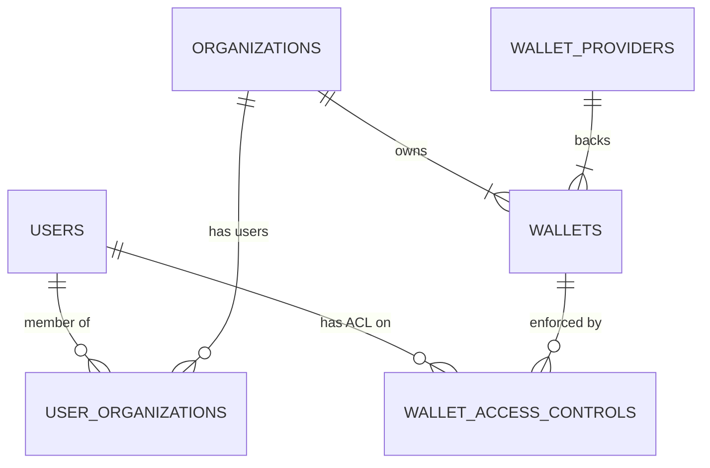

# Wallet Service Implementation Spec – **Technical TODO (MVP)**  
_OpenStableNetwork • API v4 • Last updated: 23 Apr 2025_

---

## 0 Quick Index

1. [Glossary](#1-glossary)  
2. [Custody Model & Flow Diagrams](#2-custody-model--flow-diagrams)  
3. [Database Schema & Enumerations](#3-database-schema--enumerations)  
4. [State Machines](#4-state-machines)  
5. [API Contract](#5-api-contract)  
6. [Service Responsibilities & Code Skeletons](#6-service-responsibilities--code-skeletons)  
7. [System Context & Related Services](#7-system-context--related-services)  
8. [Observability & Dev‑Ops Deliverables](#8-observability--dev-ops-deliverables)  
9. [Sprint Checklist](#9-sprint-checklist)  
10. [Definition of Done](#10-definition-of-done)  
11. [Current Implementation Status & Gap Analysis](#11-current-implementation-status--gap-analysis)
12. [Appendix A – Live DB Schema (23 Apr 2025)](#appendix-a-–-live-database-schema-snapshot-23-apr-2025)
13. [Appendix B – Postgres Migration Plan](#appendix-b-–-postgres-migration-plan)

---

## 1 Glossary

| Term                            | Meaning                                                                                                                      |
|---------------------------------|------------------------------------------------------------------------------------------------------------------------------|
| **Custody type**<br>`provider_type` | Where the private key lives: `metamask`, `fireblocks`, `hex_trust`, `self_custody` (Phase 2 - not in MVP)                   |
| **Wallet provider**             | Configuration record for a custody integration                                                                               |
| **PSP**                         | Payment Service Provider                                                                                                     |
| **KMS / HSM**                   | Key‑management or hardware security module for self‑custody (Phase 2 - not in MVP)                                           |
| **ACL / `access_level`**        | `owner`, `admin`, `operator`, `viewer`                                                                                       |
| **Tx status**                   | `pending_signature`, `signed`, `rejected`, `submitted`, `failed`, `confirmed`                                               |
| **Idempotency‑Key**             | Header to ensure at‑most‑once execution of mutating requests                                                                 |

---

## 2 Custody Model & Flow Diagrams

### 2.1 Topology

```
┌────────────────┐      ┌────────────────┐      ┌───────────────────┐
│  Transfer svc  │◄───►│   Wallet svc   │◄───►│  Custody Back‑ends │
└────────────────┘      └────────────────┘      └───────────────────┘
                                     ▲
                                     └─ MetaMask (browser‑only signing)
```

### 2.2 Flows

#### MetaMask / Browser Wallet

```
Transfer svc → Wallet svc → Frontend (MetaMask) → Wallet svc → Transfer svc → Blockchain
```

#### Custodial MPC (Fireblocks/Hex Trust) - MVP Focus

```
Transfer svc → Wallet svc → Custodial API → Wallet svc → Transfer svc → Blockchain
```

**MVP Implementation Strategy:**
- We will ship **Fireblocks integration first** (primary focus) due to its mature API and established vault account structure
- **Hex Trust** will be implemented as a plug-in with similar architecture, as its API follows a similar MPC-style model
- Both allow for institutional-grade wallet management with proper key security and governance

#### Self‑Custody (KMS/HSM) - Phase 2, Not in MVP

```
Transfer svc → Wallet svc → KMS/HSM → Wallet svc → Transfer svc → Blockchain
```

*Note: Self-custody model is excluded from MVP scope but API/DB interfaces are maintained for future compatibility.*

---

## 3 Database Schema & Enumerations

> **Migrations:** Use your chosen framework; scripts must be idempotent and reversible.

```sql
-- Wallet Providers
CREATE TABLE wallet_providers (
  id TEXT PRIMARY KEY,
  name TEXT NOT NULL,
  provider_type TEXT NOT NULL CHECK (provider_type IN ('fireblocks','hex_trust','self_custody')),
  credentials JSONB NOT NULL,
  status TEXT NOT NULL DEFAULT 'active' CHECK (status IN ('active','inactive')),
  created_at TIMESTAMP WITH TIME ZONE DEFAULT now(),
  updated_at TIMESTAMP WITH TIME ZONE DEFAULT now()
);

-- Wallets
CREATE TABLE wallets (
  id TEXT PRIMARY KEY,
  organization_id TEXT REFERENCES organizations(id),
  provider_type TEXT NOT NULL CHECK (provider_type IN ('metamask','fireblocks','hex_trust','self_custody')), -- self_custody = reserved (Phase 2)
  wallet_provider TEXT REFERENCES wallet_providers(id),
  blockchain TEXT NOT NULL,
  network TEXT NOT NULL,
  address TEXT NOT NULL,
  status TEXT NOT NULL DEFAULT 'pending_configuration'
         CHECK (status IN ('active','pending_configuration','inactive','suspended')),
  default_wallet BOOLEAN NOT NULL DEFAULT FALSE,
  description TEXT,
  created_at TIMESTAMP WITH TIME ZONE DEFAULT now(),
  updated_at TIMESTAMP WITH TIME ZONE DEFAULT now(),
  UNIQUE(blockchain, network, address)
);

-- Access Controls
CREATE TABLE wallet_access_controls (
  wallet_id TEXT REFERENCES wallets(id) ON DELETE CASCADE,
  user_id TEXT REFERENCES users(id) ON DELETE CASCADE,
  access_level TEXT NOT NULL CHECK (access_level IN ('owner','admin','operator','viewer')),
  daily_limit NUMERIC,
  approval_required BOOLEAN DEFAULT FALSE,
  created_at TIMESTAMP WITH TIME ZONE DEFAULT now(),
  updated_at TIMESTAMP WITH TIME ZONE DEFAULT now(),
  PRIMARY KEY(wallet_id, user_id)
);

-- Transaction Signatures
CREATE TABLE transaction_signatures (
  id TEXT PRIMARY KEY,
  wallet_id TEXT REFERENCES wallets(id) ON DELETE CASCADE,
  unsigned_tx JSONB NOT NULL,
  signed_tx JSONB,
  status TEXT NOT NULL CHECK (status IN ('pending_signature','signed','rejected','submitted','failed','confirmed')),
  expires_at TIMESTAMP WITH TIME ZONE,
  created_at TIMESTAMP WITH TIME ZONE DEFAULT now(),
  updated_at TIMESTAMP WITH TIME ZONE DEFAULT now()
);
```

### 3.1 Enumerations

| Enum             | Values                                                   |
|------------------|----------------------------------------------------------|
| `provider_type`  | `metamask`, `fireblocks`, `hex_trust`, `self_custody` (Phase 2)   |
| `wallet_status`  | `active`, `pending_configuration`, `inactive`, `suspended` |
| `access_level`   | `owner`, `admin`, `operator`, `viewer`                  |
| `tx_status`      | `pending_signature`, `signed`, `rejected`, `submitted`,`failed`,`confirmed` |

> Invalid enum → HTTP 422.

### 3.2 Wallet Record Lifecycle & History

All wallets created or connected by users (including older MetaMask addresses, legacy custodial vaults, etc.) **remain in the `wallets` table for the life of the platform**.  Deleting a wallet in the UI simply flips its `status`:

| Status              | Meaning                                                      | Typical Trigger                                    |
|---------------------|--------------------------------------------------------------|----------------------------------------------------|
| `pending_configuration` | Newly‑created record awaiting custodian setup / user approval | Fireblocks vault being provisioned, Hex Trust account awaiting approval |
| `active`            | Wallet is fully usable for balance queries & signing        | Custodian setup complete / MetaMask address verified |
| `inactive`          | Wallet has been explicitly un‑linked by the user or org admin | User disconnects MetaMask, org retires a vault    |
| `suspended`         | Temporarily disabled by compliance / risk tooling           | Risk engine flags unusual activity                |

We **never hard‑delete** rows; keeping the record allows:
- Historical balance & transfer look‑ups
- Audit of who connected/disconnected which wallet
- Re‑activation if the user reconnects the same address

#### Optional: Connection History Audit Table
If finer‑grained auditing is required, add:
```sql
CREATE TABLE wallet_connection_history (
  id TEXT PRIMARY KEY,
  wallet_id TEXT REFERENCES wallets(id) ON DELETE CASCADE,
  user_id TEXT REFERENCES users(id),           -- who performed the action
  action TEXT NOT NULL CHECK (action IN ('connected','disconnected','reconnected')),
  context JSONB,                              -- e.g. browser info, custodian response
  created_at TIMESTAMP WITH TIME ZONE DEFAULT now()
);
```
This table can be populated by the API layer each time a wallet is connected or disconnected, giving a complete timeline without polluting the main `wallets` table with transient metadata.

### 3.3 Relational Map – Users, Organizations, Wallets & Custodians

The logical links that underpin access control and signing flows:



Key points:
1. **User ↔ Organisation** – a user belongs to _at least_ one organisation (MVP can store this as `users.organization_id`; future‑proof by a join‑table `user_organizations`).
2. **Organisation ↔ Wallets** – every wallet row carries `organization_id`; multiple users may access the same wallet via ACLs.
3. **ACL Enforcement (`wallet_access_controls`)** – composite PK `(wallet_id,user_id)` with `access_level` enum ensures precise rights checks (owner/admin/operator/viewer).
4. **Wallet ↔ Custodian (`wallet_providers`)** – `wallet_provider` FK selects the custodian adapter; `provider_type` drives run‑time dispatch (`_sign_fireblocks`, `_sign_hex_trust`, …).

This mapping must be honoured by the migration described in §11.3 and Appendix B to unlock org‑shared wallets and proper custody routing.

---

## 4 State Machines

### Wallet Status

| From \ To              | active | pending_configuration | inactive | suspended |
|------------------------|--------|-----------------------|----------|-----------|
| **active**             | —      | ✓                     | ✓        | ✓         |
| **pending_configuration** | ✓  | —                     | ✓        | ✓         |
| **inactive**           | ✓      | —                     | —        | ✓         |
| **suspended**          | ✗      | ✗                     | ✗        | —         |

✗ = forbidden → HTTP 409.

### Transaction Lifecycle

```
Pending → Signed → Submitted → Confirmed
   └─────┬─────┘           ↘ Failed
         ↘ Rejected
```

*Default `expires_at` = 10 minutes.*

---

## 5 API Contract

Base path: `/api/v4` | All endpoints require authentication.

### 5.1 Wallet CRUD

- **POST** `/wallets`  
- **GET** `/wallets` (filters: `status`, `blockchain`, `organization_id`)  
- **GET** `/wallets/{id}`  
- **PATCH** `/wallets/{id}` (fields: `name`, `description`, `default_wallet`)

### 5.2 Balances

- **GET** `/wallets/{id}/balances` → `[{currency, amount}]`

### 5.3 Signing

- **POST** `/wallets/{id}/sign` → `{status, signature_request_id, unsigned_tx?}`
- **POST** `/wallets/submit_signature` → `{status: "signed", signature_request_id}`

### 5.4 Examples

#### Create Wallet

```json
POST /api/v4/wallets
{
  "name": "My MetaMask Wallet",
  "blockchain": "ethereum",
  "network": "mainnet",
  "provider_type": "metamask",
  "address": "0x123..."
}
```

#### Initiate Signing

```json
POST /api/v4/wallets/{id}/sign
{
  "to": "0x456...",
  "amount": "0.1",
  "currency": "ETH"
}
→
{
  "status": "requires_frontend_signature",
  "signature_request_id": "req_abc",
  "unsigned_transaction": { /* EIP‑1559 fields */ }
}
```

### 5.5 Error Model

```jsonc
{
  "error_code": "wallet_not_found",
  "message": "Wallet not accessible",
  "details": { "parameter": "wallet_id", "value": "..." }
}
```

Common codes:  
- `400 invalid_payload`  
- `401 unauthenticated`  
- `403 unauthorized`  
- `404 not_found`  
- `409 conflict`  
- `422 validation_error`  
- `429 rate_limited`  
- `500 internal_error`

### 5.6 Idempotency

All mutating endpoints accept an **Idempotency‑Key** header; the first successful response is reused for retries within 24 h.

---

## 6 Service Responsibilities & Code Skeletons

### WalletService

```python
class WalletService:
    async def create_wallet(self, user_id, data, organization_id=None): ...
    async def get_wallet(self, wallet_id, user_id=None): ...
    async def list_wallets(self, user_id, filters=None): ...
    async def update_wallet(self, wallet_id, patch, acting_user): ...
    async def get_wallet_balances(self, wallet_id, acting_user=None): ...
    async def update_wallet_balance(self, wallet_id, currency, delta): ...
    async def add_user_access(self, wallet_id, user_id, level): ...
    async def remove_user_access(self, wallet_id, user_id): ...
```

*Enforce ACL; ledger updates in a single serialized transaction.*

### WalletSigningService

```python
class WalletSigningService:
    async def sign_transaction(self, wallet_id, tx_data, user_id):
        wallet = await WalletService().get_wallet(wallet_id, user_id)
        handler = getattr(self, f"_sign_{wallet['provider_type']}")
        return await handler(wallet, tx_data)
        
    async def _sign_metamask(self, wallet, tx): 
        """
        1. Generate unsigned transaction object
        2. Return with status 'requires_frontend_signature'
        3. Frontend handles browser MetaMask interaction
        4. Wait for callback with signed tx
        """
        # Implementation
        
    async def _sign_fireblocks(self, wallet, tx):
        """
        1. Build Fireblocks 'createTransaction' payload (VAULT → EXTERNAL)
        2. POST /v1/transactions
        3. Poll /v1/transactions/{id} until 'COMPLETED' or 'FAILED'
        4. Map Fireblocks status to internal enum
        5. Return signed-tx blob when CONFIRMED
        """
        # Implementation
        
    async def _sign_hex_trust(self, wallet, tx):
        """
        1. Build Hex Trust transaction payload
        2. POST /api/v1/transactions
        3. Poll status endpoint or wait for webhook callback
        4. Map Hex Trust status to internal enum
        5. Return tx details when signed
        """
        # Implementation
        
    async def _sign_self_custody(self, wallet, tx):
        """
        Phase 2 - Not implemented in MVP
        Will use key management service or HSM integration
        """
        raise NotImplementedError("Self-custody signing not available in MVP")
```

Background cleanup for expired signature requests.

### TransferService Uplift

1. Validate balance via `WalletService.get_wallet_balances()`.  
2. For on‑chain: call `sign_transaction()`, then broadcast when signed.  
3. Perform ledger debit/credit in the same DB transaction.

### Organization & Approval Workflows

For MVP, the Wallet Service is organization-aware but does not implement maker-checker workflows. Critical operations like wallet creation and transactions are executed immediately by authorized users.

When dual-control becomes necessary for wallet operations:
1. The `approval_required` flag in `wallet_access_controls` can trigger the flow
2. We could reuse the `ActionService` and approval tables defined in other spec
3. Route high-value/sensitive wallet operations through the maker-checker pipeline

For now, access control is enforced via the `access_level` checks, with organization context maintained throughout. This needs to be considered. 

## 6.1 Custodian Integration Details

### Custodian Adapter Pattern (Implementation Recommendation)

To address the complexity of integrating multiple custodians with different vault/account endpoints and terminology, implement a provider adapter pattern:

```python
# Abstract base class for all custodian integrations
class CustodianAdapter:
    async def create_wallet(self, organization_id, params):
        """Create wallet/vault/account at the custodian"""
        pass
        
    async def get_balances(self, wallet_id, currencies=None):
        """Get balances from custodian for wallet"""
        pass
        
    async def sign_transaction(self, wallet_id, tx_data):
        """Sign transaction using custodian"""
        pass
        
    async def get_deposit_address(self, wallet_id, asset):
        """Generate deposit address"""
        pass
        
# Concrete implementations
class FireblocksAdapter(CustodianAdapter):
    # Implements methods using Fireblocks-specific endpoints (/vault/accounts/...)
    pass
    
class HexTrustAdapter(CustodianAdapter):
    # Implements methods using Hex Trust-specific endpoints (/accounts/...)
    pass
```

This pattern ensures:
- Core services interact with a consistent interface regardless of provider
- Provider-specific API differences (endpoints, parameters, authentication) are encapsulated
- New custodians can be added without changing core service logic
- Terminology differences (vaults vs accounts) are abstracted away

### Fireblocks (MVP Custodian)

- **API Base URL**: `https://api.fireblocks.io/v1`
- **Authentication**: JWT with HMAC-SHA256 signature using API key and secret
- **Key Endpoints**:
  - `GET /vault/accounts` - List all vault accounts
  - `GET /vault/accounts/{vaultAccountId}` - Get specific vault account
  - `POST /transactions` - Create and submit a new transaction
  - `GET /transactions/{txId}` - Get transaction status by ID
- **Webhook Integration**: Provides real-time transaction updates
- **SDK**: Official SDKs available for Node.js, Python, Java

### Hex Trust (MVP Custodian)

- **API Base URL**: `https://api.hextrust.com/api/v1`
- **Authentication**: API key and secret in request headers
- **Key Endpoints**:
  - `GET /accounts` - List custody accounts
  - `GET /accounts/{accountId}/balances` - Get account balances
  - `POST /transactions` - Create transaction for signing
  - `GET /transactions/{txId}` - Get transaction status
- **Webhook Integration**: Available for transaction status changes
- **Note**: Implementation details may vary slightly; adapt based on current API documentation

---

## 7 System Context & Related Services

### 7.0 Big‑Picture Architecture Snapshot

> The Wallet Service sits within a larger ecosystem of microservices.  The diagram below (adapted from `docs/architecture/dependency-graph.md`) shows where it fits so the implementation team can understand upstream/downstream relationships at a glance.

```text
                                  C01
                         [User/Auth Service]
                           ↙           ↘
                          ↙             ↘
                         ↙               ↘
                        ↓                 ↓
                C03                        C04
       [Wallet Service Base]        [Organization Service]
                |                      ↙           ↘
                |                     ↙             ↘
                ↓                    ↓               ↓
                C02                 C05              C06
     [Transfer Service Base]  [Action Service] [Enhanced Wallet Service]
                                    |             ↙     |     ↘
                                    |            ↙      |      ↘
                                    ↓           ↓       |       ↓
                                   C07 ←────────┘      C08      C10
                            [Minter Management]  [Enhanced    [Bridge
                                    |            Transfer     Service]
                                    |            Service]        ↑
                                    |               |           |
                                    |               |           |
                                    ↓               ↓          ⋯⋯⋯
                                    C11 ⋯⋯⋯⋯⋯⋯⋯⋯⋯ C09 ⋯⋯⋯⋯⋯⋯⋯
                              [PSP Service]    [Trading
                               (Future)        Service]

Legend:
→ Dependency
⋯ Optional/Future Dependency
[Base Components] C01, C02, C03  
[Foundation Components] C04, C05
[Enhanced Components] C06, C07, C08, C09, C10
[Future Components] C11
```

*The Wallet Service you are building is **C03 / C06** depending on the enhancement level.  For the MVP, focus on C03 functionality while keeping extension hooks for the C06 enhanced version.*

- **Identity & Access Service**: Provides authentication and organization management
  - Wallet Service consumes user and organization data
  - Access control lists (ACLs) rely on identity verification

- **Transfer Service**: Initiates asset transfers between wallets
  - Requests transaction signing from Wallet Service
  - Manages transaction lifecycle and confirmations
  - Responsible for broadcasting signed transactions

- **Balance & Ledger Management (within Wallet Service)**: Handles balance updates and ledger integrity.
  - Wallet Service directly updates the `balances` table. 
  - Ensures atomicity and consistency of balance changes (e.g., within DB transactions).

- **Notification Service**: Alerts users of pending actions
  - Wallet Service triggers notifications for signing requests
  - Delivers status updates for transaction confirmations

### 7.2 Integration Points

- **Custody Providers**: External services for key management
  - Wallet Service abstracts provider-specific APIs
  - Supports multiple provider types (Fireblocks, Hex Trust, etc.)

- **Blockchain Networks**: On-chain transaction processing
  - Wallet Service prepares unsigned transactions
  - Transfer Service handles chain-specific broadcast logic

### 7.3 Deployment Context

The Wallet Service should be deployed as a microservice with:
- Independent scaling from other services
- Database isolation with proper connection pooling
- Secure credential access via environment or secret management

### 7.4 On-Chain vs Off-Chain MVP Considerations

For the initial MVP implementation:

- **Simplify Blockchain Interactions**: 
  - Focus on MetaMask flow only, with minimal actual blockchain interaction
  - Use simulated/mocked responses where appropriate for testing
  - Defer complex on-chain validation logic to later phases

- **Balance Management Strategy (choose during implementation):**
  
  | Strategy | Description | Pros | Cons | Suggested Custody Types |
  |----------|-------------|------|------|------------------------|
  | **Internal Ledger** (use `balances` table) | Wallet Service persists debits/credits in DB and treats the ledger as the source of truth.  External balances are reconciled asynchronously. | Fast reads, simple math, no RPC latency. | Requires reconciliation job; risk of drift if on‑chain tx occurs outside platform. | Custodial MPC (Fireblocks/Hex Trust), off‑chain settlement flows |
  | **Direct On‑Chain Query** | Balance endpoint calls chain RPC (e.g., `eth_getBalance`) in real time. | Always accurate vs. chain; no drift. | Slower; rate‑limit issues; chain fees for some calls. | MetaMask, self‑custody wallets |
  | **Custody API Query** | Balance endpoint proxies to provider's balance API (Fireblocks `/vault/accounts`) | Accurate to custody system; avoids drift. | Coupling to provider; potential API latency costs. | Fireblocks, Hex Trust |

  **MVP Decision:**
  1. Default to **Internal Ledger** for *write* operations (debits/credits).
  2. Expose a *read switch* (feature flag or per‑wallet setting) that lets the API fall back to On‑Chain / Custody API queries when needed.
  3. Implementation team must document the selected approach in a design note and provide a reconciliation plan if Internal Ledger is chosen.

  ```python
  # pseudo‑interface
  class BalanceSource(Protocol):
      async def get_balance(self, wallet: Wallet, currency: str) -> Decimal: ...
  ```

  Build pluggable adapters (`LedgerSource`, `OnChainSource`, `CustodyApiSource`) so adding new custody types later doesn't require refactor.

- **Transaction Processing**:
  - Build transaction objects and signing flows correctly
  - For MetaMask, focus on the browser-wallet integration path
  - Actual broadcasting can be simplified for MVP (e.g., use Infura/Alchemy directly)

The key is to implement clean interfaces that separate blockchain-specific logic from core service functions. This ensures we can enhance blockchain interaction in future iterations without major refactoring.

---

## 8 Observability & Dev‑Ops Deliverables

- **Logging:** structured, with `trace_id`, `user_id`, `wallet_id`, `action`.  
- **Metrics:** track request durations, balance updates, signature statuses.  
- **Dashboards:** provide key dashboards in your monitoring system.  
- **Alerts:** notify on error rate spikes or latency regressions.  
- **Infrastructure as Code:** define DB, service, and secret infrastructure.

---

## 9 Sprint Checklist

### Database
- [ ] Define & apply migrations for all tables  
- [ ] Ensure migrations are reversible & idempotent  

### Core Logic
- [ ] Implement `WalletService` methods & ACL enforcement  
- [ ] Implement `_sign_metamask`, `_sign_fireblocks` (+ webhook), `_sign_hex_trust` stub; `self_custody` = Phase 2  
- [ ] Integrate signing into `TransferService`  
- [ ] **Produce Balance‑Source Design Note** outlining chosen strategy, adapter design, and reconciliation plan  

### API
- [ ] Expose CRUD & balance endpoints  
- [ ] Expose signing initiation & submission endpoints  
- [ ] Generate API schema (OpenAPI/Swagger)  

### Security & Middleware
- [ ] Apply authentication & ACL checks  
- [ ] Apply rate limiting  

### Observability
- [ ] Emit structured logs  
- [ ] Emit and visualize key metrics  
- [ ] Configure alerts  

### Dev‑Ops
- [ ] IaC, secret mgmt, CI migrations  

---

## 10 Definition of Done

1. All checklist items complete ✓  
2. Migrations apply and rollback cleanly  
3. MVP flows (create, balance, sign, broadcast) fully functional  
4. Monitoring & alerts in place  
5. API schema published  
6. Handoff documentation delivered  

— End of Technical TODO —

## 11 Current Implementation Status & Gap Analysis (Auto‑generated)

### 11.1 Snapshot of the Running Codebase  
*(Inspected 23 Apr 2025 – stablecoin.db (developer)*

**Live SQLite schema (`sqlite3 stablecoin.db .schema` – relevant extracts)**
```sql
-- Wallet master table (leaner than spec)
CREATE TABLE wallets (
    id INTEGER PRIMARY KEY AUTOINCREMENT,
    user_id INTEGER NOT NULL,
    blockchain TEXT NOT NULL,
    address TEXT NOT NULL,
    status TEXT DEFAULT 'active',
    created_at TEXT NOT NULL,
    details TEXT,
    FOREIGN KEY (user_id) REFERENCES users (id)
);

-- Internal ledger balances
CREATE TABLE balances (
    wallet_id TEXT NOT NULL,
    currency  TEXT NOT NULL,
    amount    REAL DEFAULT 0.0,
    available REAL DEFAULT 0.0,
    pending   REAL DEFAULT 0.0,
    user_id   TEXT NOT NULL,
    created_at TIMESTAMP DEFAULT CURRENT_TIMESTAMP,
    updated_at TIMESTAMP DEFAULT CURRENT_TIMESTAMP,
    PRIMARY KEY (wallet_id, currency),
    FOREIGN KEY (wallet_id) REFERENCES wallets (id),
    FOREIGN KEY (user_id)   REFERENCES users (id)
);
```
Other runtime tables that *reference* `wallets`: `transfers.source_wallet_id`, `minting_history.{source_wallet_id,destination_wallet_id}`, `minter_tokens.wallet_id`, `redeem_requests.source_wallet_id`.

*What's missing versus spec?*
- Administrative tables: `wallet_providers`, `wallet_access_controls`, `transaction_signatures`, `wallet_connection_history`.
- Extra columns on `wallets` (`organization_id`, `network`, `wallet_provider`, `default_wallet`, `updated_at`).
- Enum `CHECK` constraints for statuses & provider types.

*Why the difference?*  The DB file was seeded by an older script; the richer DDL in `backend/core/database.py` has **never been applied**.  No migration framework is presently in place to reconcile the two.

**API surface currently live (`backend/routes/wallets.py`)**  
- `POST   /api/v4/users/me/wallets` – create wallet  
- `GET    /api/v4/users/me/wallets` – list (filterable)  
- `DELETE /api/v4/users/me/wallets/{id}` – delete (soft)  
- `PATCH  /api/v4/users/me/wallets/{id}/status` – toggle active/inactive  
- Balance sub‑routes per wallet & aggregate  
- No `/wallets/{id}/sign`, `/wallets/submit_signature`, or provider CRUD endpoints.

**Service layer (`backend/services/wallet_service.py`)**
- Implements CRUD & balance helpers against SQLite using raw SQL.
- No ACL enforcement beyond *user → wallet* ownership.
- Organization context checked only on wallet creation; not throughout.
- No interaction with custodians (Fireblocks/Hex Trust) or MetaMask signing logic.

**Support utilities**
- Simple SQLite helper; no migration framework (Alembic/Flyway).
- Idempotency key dependency stub exists but not persisted.
- Logging via `print`; no metrics/alerts.

### 11.2 Gap Analysis vs. Section 9 Sprint Checklist

| Area | Spec Requirement | Current Code | Gap |
|------|------------------|--------------|-----|
| **Database** | Idempotent reversible migrations; tables: `wallet_providers`, `wallet_access_controls`, `transaction_signatures`, enum constraints | Single `init_db()` creating minimal `wallets`, `balances`; no migrations; enums not enforced | • Introduce migration layer (Alembic)  <br>• Add missing tables & CHECK constraints |
| **Core Logic** | Full `WalletService` incl. ACL, ledger serialisation; `WalletSigningService` with provider adapters | Partial `WalletService`; no ACL, no signing, no ledger tx mgmt | • Implement ACL matrix  <br>• Build `CustodianAdapter` pattern and concrete Fireblocks path  <br>• Add transaction lifecycle mgmt |
| **API** | CRUD `/wallets`, balances, signing endpoints | Only user‑scoped `/users/me/wallets`; no signing endpoints | • Add org‑level routes  <br>• Expose `/sign`, `/submit_signature` |
| **Security & Middleware** | Auth, ACL, rate‑limit, enum validation | Basic auth stub; no rate‑limiting; no enum validation | • Integrate full auth service  <br>• Apply rate‑limit middleware  <br>• Validate enums via Pydantic/DB |
| **Observability** | Structured logging, metrics, dashboards, alerts | `print()` debugging | • Add log middleware + OpenTelemetry  <br>• Emit Prometheus metrics and Grafana dashboards |
| **Dev‑Ops** | IaC, secret mgmt, CI migrations | Manual setup script; secrets in env vars | • Terraform/Ansible for DB + service  <br>• Add CI checks |

**High‑level blockers to MVP**
1. Custodian integrations & signing flow absent.  
2. DB model lacks critical tables + migrations.  
3. ACL & multi‑org logic incomplete.  
4. Observability and security hardening required.

> Until these gaps are closed, the Wallet Service cannot be considered MVP‑complete per Definition of Done §10.

### 11.3 Technical Priority – **Database Alignment & Migrations**

This is a *critical engineering task* to unblock all further Wallet‑Service work:

1. **Introduce a migration framework** (Alembic recommended) seeded with the *live* SQLite schema in Appendix A.
2. **Create a migration** that:
   • Adds `wallet_providers`, `wallet_access_controls`, `transaction_signatures`, `wallet_connection_history` tables.  
   • Alters `wallets` to include `organization_id`, `network`, `wallet_provider`, `default_wallet`, `updated_at` and back‑fills defaults.  
   • Adds `CHECK` constraints for enum columns (`status`, `access_level`, `provider_type`, `tx_status`).
3. **Forward‑port** the migration to Postgres (production target) and ensure tests run against both SQLite (dev) and Postgres (CI).

All subsequent features (ACL, signing, custodian adapters) depend on this alignment.

---

## Appendix A – Live Database Schema (snapshot 23 Apr 2025)

> Source: `sqlite3 stablecoin.db ".schema"` filtered for wallet–related tables and those that reference `wallets`.

```sql
-- Users (FK parent)
CREATE TABLE users (
    id INTEGER PRIMARY KEY AUTOINCREMENT,
    email TEXT UNIQUE NOT NULL,
    password TEXT NOT NULL,
    kyc_status TEXT DEFAULT 'verified'
);

-- Wallets (current production shape)
CREATE TABLE wallets (
    id INTEGER PRIMARY KEY AUTOINCREMENT,
    user_id INTEGER NOT NULL,
    blockchain TEXT NOT NULL,
    address TEXT NOT NULL,
    status TEXT DEFAULT 'active',
    created_at TEXT NOT NULL,
    details TEXT,
    FOREIGN KEY (user_id) REFERENCES users (id)
);

-- Internal ledger balances
CREATE TABLE balances (
    wallet_id TEXT NOT NULL,
    currency  TEXT NOT NULL,
    amount    REAL DEFAULT 0.0,
    available REAL DEFAULT 0.0,
    pending   REAL DEFAULT 0.0,
    user_id   TEXT NOT NULL,
    created_at TIMESTAMP DEFAULT CURRENT_TIMESTAMP,
    updated_at TIMESTAMP DEFAULT CURRENT_TIMESTAMP,
    PRIMARY KEY (wallet_id, currency),
    FOREIGN KEY (wallet_id) REFERENCES wallets (id),
    FOREIGN KEY (user_id)   REFERENCES users (id)
);

-- Transfers referencing wallets
CREATE TABLE transfers (
    id TEXT PRIMARY KEY,
    user_id INTEGER NOT NULL,
    recipient_id TEXT NOT NULL,
    amount TEXT NOT NULL,
    source_currency TEXT NOT NULL,
    destination_currency TEXT NOT NULL,
    status TEXT NOT NULL,
    created_at TEXT NOT NULL,
    source_wallet_id TEXT NOT NULL,  -- FK to wallets(id)
    reference TEXT,
    source_network TEXT,
    destination_network TEXT,
    FOREIGN KEY (user_id) REFERENCES users (id)
);

-- Minting history with wallet links
CREATE TABLE minting_history (
    id TEXT PRIMARY KEY,
    type TEXT NOT NULL,
    user_id TEXT NOT NULL,
    status TEXT NOT NULL,
    minter_id TEXT NOT NULL,
    minter_name TEXT NOT NULL,
    amount TEXT NOT NULL,
    currency TEXT NOT NULL,
    transaction_hash TEXT,
    fees TEXT NOT NULL,
    created_at TIMESTAMP NOT NULL,
    completed_at TIMESTAMP,
    destination_wallet_id TEXT,
    destination_network TEXT,
    destination_address TEXT,
    source_wallet_id TEXT,
    source_network TEXT,
    source_address TEXT,
    FOREIGN KEY (user_id) REFERENCES users (id)
);

-- Custodial token inventory per wallet
CREATE TABLE minter_tokens (
    id TEXT PRIMARY KEY,
    minter_id TEXT,
    wallet_id TEXT,
    token_address TEXT,
    token_name TEXT,
    chain_name TEXT,
    created_at TIMESTAMP DEFAULT CURRENT_TIMESTAMP,
    updated_at TIMESTAMP,
    FOREIGN KEY (minter_id) REFERENCES minters(id)
);

-- Redeem requests linking to source wallet
CREATE TABLE redeem_requests (
    id TEXT PRIMARY KEY,
    user_id TEXT NOT NULL,
    minter_id TEXT NOT NULL,
    amount TEXT NOT NULL,
    currency TEXT NOT NULL,
    status TEXT NOT NULL,
    source_wallet_id TEXT,
    source_network TEXT,
    source_address TEXT,
    created_at TIMESTAMP NOT NULL DEFAULT CURRENT_TIMESTAMP,
    updated_at TIMESTAMP,
    completed_at TIMESTAMP,
    transaction_hash TEXT
);

-- Organizations master table
CREATE TABLE organizations (
    id TEXT PRIMARY KEY,
    name TEXT NOT NULL,
    description TEXT,
    logo_url TEXT,
    website TEXT,
    registration_number TEXT,
    tax_id TEXT,
    industry TEXT,
    country TEXT,
    address TEXT,
    is_verified BOOLEAN DEFAULT 0,
    verification_date TIMESTAMP,
    created_at TIMESTAMP NOT NULL DEFAULT CURRENT_TIMESTAMP,
    updated_at TIMESTAMP DEFAULT CURRENT_TIMESTAMP
);

-- Banking details per organization
CREATE TABLE organization_banks (
    id TEXT PRIMARY KEY,
    organization_id TEXT,
    settlement_bank_name TEXT,
    settlement_account_number TEXT,
    settlement_routing_number TEXT,
    created_at TIMESTAMP DEFAULT CURRENT_TIMESTAMP,
    updated_at TIMESTAMP,
    FOREIGN KEY (organization_id) REFERENCES organizations(id)
);
```

This appendix serves as ground truth for migration scripts. Db diagrams should be regenerated once migrations land.